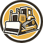
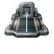
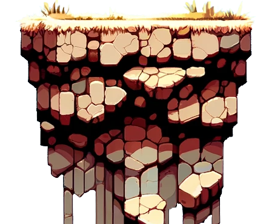

# Lemmings REVENGE!

## How To Play

### 1. Goal
The goal of the game is to help the characters move to the Portal. There is one portal on each level. A character can only enter the portal from the horizontal direction. A character cannot enter the portal from the y-direction. 

### 2. Winning
Each level has a specified number of characters that must pass through the portal. If the specified number of characters enter the portal, you win. However, if there are fewer characters remaining on the screen than are required to win the level, then the lose condition is met and you lose the game. 

### 3. Skills
Skills can be assigned to each character. The available skills can be selected from the Menu Options window at the right of the game window. Click a skill; it will highlight in yellow. Moving the mouse over a character will display an arrow icon pointing to that character. Clicking a character after a skill is selected from the menu option will assign that skill to that character. A skill will have an associated skill count determining the number of times that skill can be invoked by a character. For example, the Excavator skill will allow a character to tunnel through ground objects three times.

#### i. Blocker
The blocker skill allows a character to act as a barrier for other characters. It prevents the other characters from moving past the blocker. The blocker will not move from the position it is at when the skill is assigned.

#### ii. Excavator
The excavator skill allows a character to remove a single game object. The character will continue to remove game objects in the downward y direction for up to three game objects. Watch out! The excavator will even remove non-ground game objects like elevators!

#### iii. Miner
The miner skill allows a character to remove game objects of type Ground in a zig-zag pattern. Unlike the excavator, the miner will not dig straight down or remove non-Ground objects.

#### iv. Bomber
The bomber skill allows a character to remove all game objects in a one-unit circle around the character’s position. The bomb is invoked three seconds after the assignment of the bomber skill. Plan accordingly.

#### v. Builder
The builder skill allows a character to build up to two bridges. Each bridge will last three seconds before collapsing. The builder will only build a bridge when the character encounters a cliff. Other characters use the bridge to traverse gaps.

### 4. Game Objects
The game environment contains various game objects that the characters can interact with.

#### i. Stalagmites
Stalagmites act as an obstacle. They cannot be removed by a character skill. Careful planning will be needed to move characters around a stalagmite.

#### ii. Elevators
The elevator moves characters upward one unit. The elevator will move when a single character enters it. Elevators only move a total of 1 unit upward before coming to rest.

#### iii. Collapsible Ground
Watch out! The collapsible ground will begin to collapse after three seconds from the first time a character steps on it. After three seconds, the ground will disappear with a loud bang and your characters may fall through the new gap.

